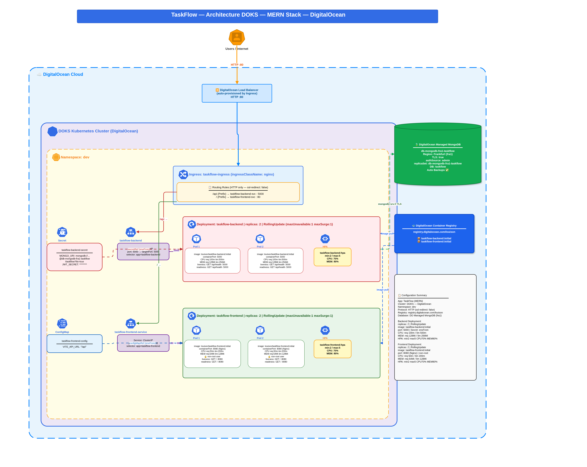
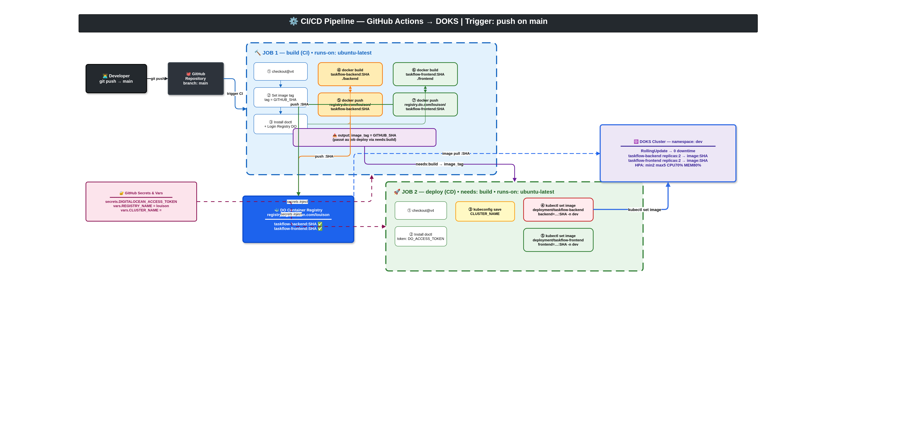

<div align="center">

# ☸️ mern-k8s-ci-cd

### **Deploying a MERN application on Kubernetes (DOKS)**
### **with GitHub Actions CI/CD Pipeline — Zero Downtime — Auto-scaling**

[](https://github.com/FANOMEZANTSOA-Bien-Aime-Louison/mern-k8s-ci-cd/actions)
[](https://cloud.digitalocean.com/kubernetes)
[](https://registry.digitalocean.com)
[](#️-stack)

</div>

---

## 🎯 DevOps Problem Statement

Deploying a multi-service application to production raises concrete challenges
that this project addresses one by one:

| ❌ Problem | ✅ Solution applied |
|---|---|
| **Manual deployments** — SSH + `docker run` by hand, human error-prone | GitHub Actions CI/CD pipeline — a single `git push` is enough |
| **Zero reproducibility** — "works on my machine" | Multistage Docker builds, immutable images tagged with Git SHA |
| **Downtime on every update** — app goes down during deployment | Kubernetes `RollingUpdate` — `maxUnavailable: 1 / maxSurge: 1` |
| **No resilience** — single process, if it crashes everything crashes | 2 minimum replicas, HPA scales up to 5 automatically |
| **Credentials in plain text** in code or scripts | Kubernetes Secrets + GitHub Encrypted Secrets |
| **No CI/CD separation** — build and deploy mixed together | 2 distinct jobs: `build` (CI) → `deploy` (CD) with `needs:` |
| **Untrackable images** — `latest` tag cannot be rolled back | Tag = `GITHUB_SHA` — every image is unique and reversible |
| **Manual scaling** — requires human intervention when load increases | HPA on CPU (70%) and memory (80%) — automatic scaling |

---

## 🏗️ Infrastructure Architecture



### Traffic Flow

```
Internet
   │  HTTP
   ▼
DigitalOcean Load Balancer   (auto-provisioned by Ingress Controller)
   │
   ▼
Ingress Nginx  ─── namespace: dev
   ├── /api/*  ──► ClusterIP Service :5000  ──► Backend Pods  (Node.js)
   └── /       ──► ClusterIP Service :80    ──► Frontend Pods (Nginx :8080)
                                                      │
                                             DO Managed MongoDB
                                             (fra1 — TLS — replicaSet)
```

### Kubernetes Manifests

| Resource | Name | Role |
|---|---|---|
| `Namespace` | `dev` | Environment isolation |
| `Ingress` | `taskflow-ingress` | HTTP routing — `ingressClassName: nginx` |
| `Deployment` | `taskflow-backend` | Node.js app — 2 replicas — RollingUpdate |
| `Deployment` | `taskflow-frontend` | Nginx — 2 replicas — RollingUpdate |
| `Service` | `taskflow-backend` | ClusterIP — `5000 → 5000` |
| `Service` | `taskflow-frontend-service` | ClusterIP — `80 → 8080` |
| `HPA` | `taskflow-backend-hpa` | min:2 max:5 — CPU 70% — MEM 80% |
| `HPA` | `taskflow-frontend-hpa` | min:2 max:5 — CPU 70% — MEM 80% |
| `Secret` | `taskflow-backend-secret` | `MONGO_URI` + `JWT_SECRET` |
| `ConfigMap` | `taskflow-frontend-config` | `VITE_API_URL=/api` |

### Resources & Probes per Pod

| | Backend | Frontend |
|---|---|---|
| **Image** | `registry.do.com/louison/taskflow-backend:SHA` | `registry.do.com/louison/taskflow-frontend:SHA` |
| **Port** | `5000` | `8080` |
| **CPU** req / lim | `100m / 500m` | `50m / 200m` |
| **MEM** req / lim | `128Mi / 256Mi` | `64Mi / 128Mi` |
| **Liveness** | `GET /api/health :5000` | `GET / :8080` |
| **Readiness** | `GET /api/health :5000` | `GET / :8080` |
| **Security** | `envFrom: secretRef` | non-root user — multistage |

---

## ⚙️ CI/CD Pipeline



**Trigger**: `push` on branch `main`

### JOB 1 — `build` (Continuous Integration)

```
① checkout
② tag = GITHUB_SHA              ← immutable and traceable image tag
③ doctl login → DO Registry
④ docker build + push  taskflow-backend:SHA   (./backend)
⑤ docker build + push  taskflow-frontend:SHA  (./frontend)
⑥ output: image_tag=SHA         ← passed to the deploy job
```

### JOB 2 — `deploy` (Continuous Deployment)

```
needs: build                    ← blocked until CI passes
① checkout
② doctl → kubeconfig DOKS
③ kubectl set image deployment/taskflow-backend  backend=…:SHA  -n dev
④ kubectl set image deployment/taskflow-frontend frontend=…:SHA -n dev
   └─► Kubernetes RollingUpdate → 0 downtime
```

### Technical Decisions

| Choice | Justification |
|---|---|
| **Tag = `GITHUB_SHA`** | Full traceability — instant rollback with `kubectl rollout undo` |
| **2 separate jobs** | A broken build never triggers a partial deploy |
| **`kubectl set image`** | Delegates rolling update to Kubernetes — no downtime |
| **`doctl kubeconfig save`** | DOKS authentication without storing kubeconfig in the repo |
| **`needs: build` + `outputs`** | SHA is cleanly passed between jobs without duplication |

### Required GitHub Secrets & Variables

```bash
# Secrets (encrypted)
DIGITALOCEAN_ACCESS_TOKEN     # DO token — registry + k8s cluster access

# Variables (non-sensitive)
REGISTRY_NAME = louison        # DigitalOcean registry name
CLUSTER_NAME  = <cluster-id>  # DOKS cluster ID
```

---

## 🔐 Security

```
┌─ Images ──────────────────────────────────────────────────┐
│  • Multistage Dockerfile — minimal final image            │
│  • Non-root user (frontend Nginx)                         │
│  • SHA tag — never "latest" in production                 │
└───────────────────────────────────────────────────────────┘
┌─ Credentials ─────────────────────────────────────────────┐
│  • MONGO_URI + JWT_SECRET → Kubernetes Secret (Opaque)    │
│  • DO Token → GitHub Encrypted Secret                     │
│  • No credential in code or images                        │
└───────────────────────────────────────────────────────────┘
┌─ Network ─────────────────────────────────────────────────┐
│  • Services as ClusterIP — not directly exposed           │
│  • Only the Load Balancer is public                       │
│  • MongoDB: TLS=true — authSource=admin                   │
└───────────────────────────────────────────────────────────┘
```

---

## 📁 Project Structure

```
mern-k8s-ci-cd/
├── .github/
│   └── workflows/
│       └── ci-cd.yml              # CI/CD pipeline — 2 jobs build + deploy
├── backend/
│   └── Dockerfile                 # Multistage — port 5000
├── frontend/
│   └── Dockerfile                 # Multistage Node+Nginx — non-root — port 8080
├── k8s/
│   ├── dev-ns.yaml                # namespace: dev
│   ├── db-secret.yaml             # taskflow-backend-secret
│   ├── cm-frontend.yaml           # taskflow-frontend-config
│   ├── backend-deployment.yaml    # replicas:2 — RollingUpdate
│   ├── backend-service.yaml       # ClusterIP :5000
│   ├── backend-hpa.yaml           # min:2 max:5 CPU:70% MEM:80%
│   ├── frontend-deployment.yaml   # replicas:2 — RollingUpdate
│   ├── frontend-service.yaml      # ClusterIP :80→8080
│   ├── frontend-hpa.yaml          # min:2 max:5 CPU:70% MEM:80%
│   └── ingress.yaml               # nginx — /api + /
├── docs/
│   ├── architecture.png           # DOKS infrastructure diagram
│   └── cicd-workflow.png          # CI/CD pipeline diagram
└── docker-compose.yaml
```

---

## 🚀 Initial Deployment

> The CI/CD pipeline takes over after this — **done only once**

```bash
# 1. Authenticate to DOKS
doctl kubernetes cluster kubeconfig save <CLUSTER_NAME>

# 2. Apply manifests in order
kubectl apply -f k8s/dev-ns.yaml
kubectl apply -f k8s/db-secret.yaml
kubectl apply -f k8s/cm-frontend.yaml
kubectl apply -f k8s/backend-deployment.yaml
kubectl apply -f k8s/backend-service.yaml
kubectl apply -f k8s/backend-hpa.yaml
kubectl apply -f k8s/frontend-deployment.yaml
kubectl apply -f k8s/frontend-service.yaml
kubectl apply -f k8s/frontend-hpa.yaml
kubectl apply -f k8s/ingress.yaml

# 3. Check cluster state
kubectl get all -n dev
kubectl get ingress -n dev
kubectl get hpa -n dev
```

---

## 📊 Useful Commands

```bash
# Track an ongoing deployment (triggered by CI/CD)
kubectl rollout status deployment/taskflow-backend  -n dev
kubectl rollout status deployment/taskflow-frontend -n dev

# Immediate rollback if something goes wrong
kubectl rollout undo deployment/taskflow-backend -n dev

# Watch HPA scale in real time
kubectl get hpa -n dev --watch

# Application logs
kubectl logs -l app=taskflow-backend  -n dev -f --tail=100
kubectl logs -l app=taskflow-frontend -n dev -f --tail=100

# External health check
curl http://<LOAD_BALANCER_IP>/api/health
```

---

## 🛠️ Stack

| Domain | Technology |
|---|---|
| **Orchestration** | Kubernetes — DOKS (DigitalOcean) |
| **CI/CD** | GitHub Actions — 2 jobs build + deploy |
| **Containerization** | Docker — Multistage Dockerfile |
| **Registry** | DigitalOcean Container Registry |
| **Ingress** | Nginx Ingress Controller |
| **Load Balancer** | DigitalOcean LB (auto-provisioned) |
| **Auto-scaling** | Horizontal Pod Autoscaler (HPA) |
| **Database** | DigitalOcean Managed MongoDB (fra1) |
| **Application** | MERN — React / Node.js / Express / MongoDB |

---

<div align="center">

**This project covers the full DevOps lifecycle:**

`Containerization` → `Private Registry` → `K8s Orchestration` → `Automated CI/CD` → `Auto-scaling` → `Zero Downtime`

</div>